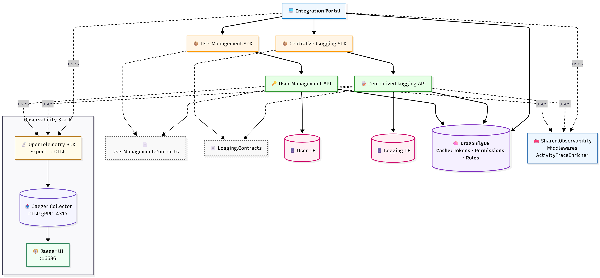
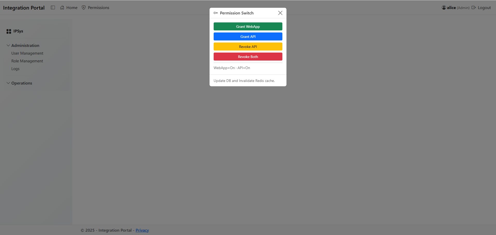
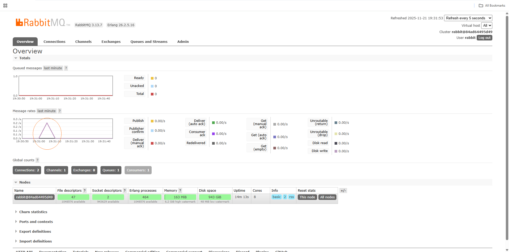
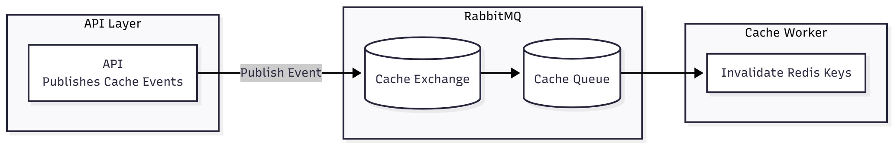

# 🚀 MessageHub 

[](https://github.com/hasanjaved-developer/MessageHub/actions/workflows/dotnet-tests.yml)
[](https://codecov.io/gh/hasanjaved-developer/MessageHub)
[](https://github.com/hasanjaved-developer/MessageHub/actions/workflows/docker-compose-ci.yml)
[](LICENSE.txt)
[](https://github.com/hasanjaved-developer/MessageHub/tags)

[](https://ghcr.io/hasanjaved-developer/message-hub/api)
[](https://ghcr.io/hasanjaved-developer/message-hub/userapi)
[](https://ghcr.io/hasanjaved-developer/message-hub/web)

### 🐳 Docker Hub Images

| Service | Pulls | Size | Version |
|----------|-------|------|----------|
| **API** | [](https://hub.docker.com/r/hasanjaveddeveloper/message-hub-api) | [](https://hub.docker.com/r/hasanjaveddeveloper/message-hub-api/tags) | [](https://hub.docker.com/r/hasanjaveddeveloper/message-hub-api/tags) |
| **User API** | [](https://hub.docker.com/r/hasanjaveddeveloper/message-hub-userapi) | [](https://hub.docker.com/r/hasanjaveddeveloper/message-hub-userapi/tags) | [](https://hub.docker.com/r/hasanjaveddeveloper/message-hub-userapi/tags) |
| **Web (Portal)** | [](https://hub.docker.com/r/hasanjaveddeveloper/message-hub-web) | [](https://hub.docker.com/r/hasanjaveddeveloper/message-hub-web/tags) | [](https://hub.docker.com/r/hasanjaveddeveloper/message-hub-web/tags) |

**MessageBus** is a lightweight RabbitMQ-powered message pipeline focused on **event-driven cache invalidation** in .NET applications.

It provides a clean pattern for publishing events from APIs after completing database updates, and processing those events asynchronously using independent worker services that connect to Dragonfly/Redis.

This approach keeps APIs fast and responsive while ensuring cache consistency across services.

The worker’s responsibility is only to remove stale keys. Any pre-warm logic (such as regenerating and repopulating cache values) remains inside the web application and will execute naturally on the next access after invalidation.

**A single role update can affect hundreds of users — so distributed cache invalidation is essential for consistent authorization.**

---

## 🔧 Features
### ✔️ Event Bus Abstraction

A minimal IEventBus interface with a RabbitMQ implementation supporting:

durable exchanges

routing keys

persistent messages

JSON serialization

### ✔️ Cache Invalidation Worker

A background worker that listens to specific events and:

receives an event from RabbitMQ

invalidates related keys in Redis/Dragonfly

(optionally) logs the invalidation action

The worker runs independently and never blocks the API.

### ✔️ Clean Publish → Process Pattern

A standard flow:

API completes database update

API publishes a cache-related event

RabbitMQ routes the event to a queue

Cache worker consumes the event

Worker removes the relevant keys in Redis

---

## 🐇 RabbitMQ Management Dashboard

Open RabbitMQ Management Dashboard:

http://localhost:15672


(default credentials: guest / guest)

---

## 🧱 Architecture Snapshot

  
<sub>[View Mermaid source](docs/integration_portal_architecture.mmd)</sub>

---

### 📸 Screenshots

---

### 🔐 Permission Change Trigger (UI Action That Publishes the Event)



### 📨 RabbitMQ — Permission Invalidation Message Received



## 🧩 Worker Process — Handling PermissionInvalidation Messages

  
<sub>[View Mermaid source](docs/cache_invalidation_diagram.mmd)</sub>

---

## 🔍 Quick Start (Preview)

```bash
# Clone the repository
git clone https://github.com/hasanjaved-developer/message-hub.git
cd message-hub

# Start the observability stack
docker compose -f docker-compose.yml up -d
```
---

## 📜 License

This project is licensed under the MIT License.

---
